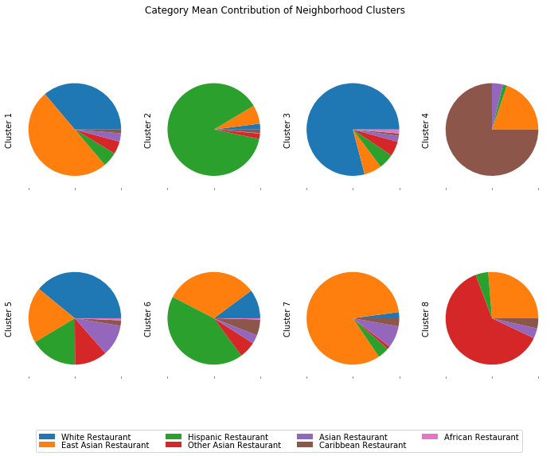

<h1 style="text-align:center">Identifying Ethnic Neighborhoods of New York City by Food Culture</h1>
<h3 style="text-align:center">Capstone Project: The Battle of Neighborhoods</h3>

<h4 style="text-align:center">Yanbo Ye</h4>
<h4 style="text-align:center">2019-05-20</h4>

## 1. Introduction

New York City is a multicultural city most popular in the United State. The population of New York City is very diverse in ethnicity, which includes non-Hispanic white (English, Italian, Irish, Russian, etc.), Hispanics White(Dominican, Puerto Rican, etc.), black(African, Caribbean, etc.), Asian(Chinese, Japanese, Korean, Indian, etc.).

### 1.1 Problem

Most people like to live in a neighborhood with those of their own ethnic group. In this study, we will try to identify the ethnicity of each neighborhood in New York City based on their food culture, specifically, the categories of **Food Venues** from location data.

### 1.2 Interest

Identifying the dominant race of each neighborhood would be helpful to those who want to live or do bushiness in New York City.

## 2. Data

### 2.1 Data Source

The neighborhood name and location data of New York City was downloaded from [New York University](https://geo.nyu.edu/catalog/nyu_2451_34572).

The food venue data with name, category and location of each neighborhood was downloaded from Foursquare's [explore api](https://developer.foursquare.com/docs/api/venues/explore).

The relation of food venue categories was downloaded from Foursquare's [categories api](https://developer.foursquare.com/docs/api/venues/categories).

### 2.2 Data Cleaning

The neighborhood data, originally in GeoJSON format, was transformed into a table with columns of `Neighborhood`, `Borough`, `Latitude`,`Longitude` and 306 entries.

|     | Neighborhood | Borough | Latitude  | Longitude  |
| --- | ------------ | ------- | --------- | ---------- |
| 0   | Wakefield    | Bronx   | 40.894705 | -73.847201 |
| 1   | Co-op City   | Bronx   | 40.874294 | -73.829939 |
| 2   | Eastchester  | Bronx   | 40.887556 | -73.827806 |
| 3   | Fieldston    | Bronx   | 40.895437 | -73.905643 |
| 4   | Riverdale    | Bronx   | 40.890834 | -73.912585 |

The category data was a nested json format, in which each category has categories attribute to represent it's subcategories. We only take subcategories under the food node and flattened the data into a 347 rows table with the category `Id`, `Name`, `ParentId`. This table will be used to clean the food venue data.

|     |            Id            |          Name           |         ParentId         |
| --- | ------------------------ | ----------------------- | ------------------------ |
| 0   | 503288ae91d4c4b30a586d67 | Afghan Restaurant       | None                     |
| 1   | 4bf58dd8d48988d1c8941735 | African Restaurant      | None                     |
| 2   | 4bf58dd8d48988d10a941735 | Ethiopian Restaurant    | 4bf58dd8d48988d1c8941735 |
| 3   | 4bf58dd8d48988d14e941735 | American Restaurant     | None                     |
| 4   | 4bf58dd8d48988d157941735 | New American Restaurant | 4bf58dd8d48988d14e941735 |

The food venue data within 500 meters radius of each neighborhood was downloaded from Foursquare API. `VenueId`, `VenueName`, `VenueLatitude`, `VenueLongitude`, `VenueCategoryId` and `VenueCategoryName` were extracted into a table of 8347 entries. 137 unique categories were found in these data. For those categories with venues less than 100, we rename the category to their parent if exist. `Sushi Restaurant` with 179 count was also merged into it's parent `Japanese Restaurant`. And then only categories with clear cultural or geographical background(such as `Chinese Restaurant`, `Italian Restaurant`, `Japanese Restaurant`, etc. full list as below.) were taken into account.

|        VenueCategoryName        | Count |
| ------------------------------- | ----- |
| Chinese Restaurant              | 559   |
| Italian Restaurant              | 485   |
| Mexican Restaurant              | 375   |
| American Restaurant             | 360   |
| Asian Restaurant                | 233   |
| Latin American Restaurant       | 220   |
| Japanese Restaurant             | 208   |
| Sushi Restaurant                | 179   |
| Spanish Restaurant              | 151   |
| Thai Restaurant                 | 135   |
| Caribbean Restaurant            | 131   |
| Indian Restaurant               | 124   |
| Korean Restaurant               | 120   |
| French Restaurant               | 120   |
| Mediterranean Restaurant        | 89    |
| Greek Restaurant                | 69    |
| Middle Eastern Restaurant       | 65    |
| Eastern European Restaurant     | 26    |
| Hawaiian Restaurant             | 23    |
| Turkish Restaurant              | 22    |
| African Restaurant              | 15    |
| German Restaurant               | 12    |
| Jewish Restaurant               | 10    |
| Russian Restaurant              | 10    |
| Polish Restaurant               | 7     |
| Halal Restaurant                | 7     |
| Irish Pub                       | 7     |
| Australian Restaurant           | 6     |
| Pakistani Restaurant            | 5     |
| Sri Lankan Restaurant           | 4     |
| Afghan Restaurant               | 4     |
| Swiss Restaurant                | 3     |
| English Restaurant              | 3     |
| Austrian Restaurant             | 3     |
| Caucasian Restaurant            | 3     |
| Scandinavian Restaurant         | 3     |
| Belgian Restaurant              | 2     |
| Ukrainian Restaurant            | 2     |
| Modern European Restaurant      | 2     |
| Portuguese Restaurant           | 2     |
| Czech Restaurant                | 1     |

This will reduce the size of our food venue dataset into 3805 entries with 40 categories and 271 neighborhoods.

|     |         VenueId          |                VenueName                | VenueLatitude | VenueLongitude |     VenueCategoryId      |   VenueCategoryName   | Neighborhood | Borough | Latitude  | Longitude  |
| --- | ------------------------ | --------------------------------------- | ------------- | -------------- | ------------------------ | --------------------- | ------------ | ------- | --------- | ---------- |
| 0   | 508af256e4b0578944c87392 | Cooler Runnings Jamaican Restaurant Inc | 40.898276     | -73.850381     | 4bf58dd8d48988d144941735 | Caribbean Restaurant  | Wakefield    | Bronx   | 40.894705 | -73.847201 |
| 9   | 4c9d5f2654c8a1cd2e71834b | Guang Hui Chinese Restaurant            | 40.876603     | -73.829710     | 4bf58dd8d48988d145941735 | Chinese Restaurant    | Co-op City   | Bronx   | 40.874294 | -73.829939 |
| 16  | 515cc20ce4b0deb133b8e89b | Fish & Ting                             | 40.885539     | -73.829151     | 4bf58dd8d48988d144941735 | Caribbean Restaurant  | Eastchester  | Bronx   | 40.887556 | -73.827806 |
| 22  | 4c632fbaeb82d13a3c5007d6 | Golden Krust Caribbean Bakery and Grill | 40.888543     | -73.831278     | 4bf58dd8d48988d144941735 | Caribbean Restaurant  | Eastchester  | Bronx   | 40.887556 | -73.827806 |
| 25  | 4dbf84a24df0f8fd6b88c9b6 | Royal Caribbean Bakery                  | 40.888252     | -73.831457     | 4bf58dd8d48988d144941735 | Caribbean Restaurant  | Eastchester  | Bronx   | 40.887556 | -73.827806 |

## 3. Methodology

In this project, we'll try to cluster neighborhoods in New York City and assign each neighborhood an ethnic label based on the categories of venues nearby using k-means algorithms. We already prepared 40 ethnic food categories and 3805 venues of 271 neighborhoods. Before we start clustering, let's first define our neighborhood feature matrix to be used to solve the problem.

1. For one neighborhood, the vector of venue count of each categories denote as:

$$\vec C = (c_1, c_2, \cdots, c_n)$$

2. As we only consider how much weight each category contribute to the final ethnic label of the neighborhood, we'll define neighborhood feature vector as:

$$\vec F = \frac{\vec C}{\sum_{i=1}^n{c_i}}$$

3. For all $m$ neighborhood, we got our feature matrix as:

$$F =
\begin{pmatrix}
\vec F_1\\
\vec F_2\\
\vdots\\
\vec F_m\\
\end{pmatrix}$$

After clustering, we need to examine the cluster and assign each cluster an label. Suppose we got $k$ clusters. For each cluster with $N$ neighborhoods, we use the mean to measure each category weight. We got our category weight matrix of clusters as:

$$E =
\begin{pmatrix}
\frac{\sum_{i=1}^{N_1} \vec F_i}{N_1} \\
\frac{\sum_{i=1}^{N_2} \vec F_i}{N_2} \\
\vdots\\
\frac{\sum_{i=1}^{N_k} \vec F_i}{N_k} \\
\end{pmatrix}$$

### 3.1 Clustering with raw categories

First, we use 40 category features to cluster neighborhoods using k-means. The elbow curve (Fig 1.) was plot to find an optimal number of clusters.

<figure style="text-align:center">
  
  <figcaption>Fig 1. Clustering elbow curve based on raw categories</figcaption>
</figure>

There's no quite obvious elbow points on the curve. Maybe 6 or 8 can be the choice and we choose 8. The weight of top 10 categories for the result clusters were plotted in pie chart (Fig 2.).

<figure style="text-align:center">
  
  <figcaption>Fig 2. Category mean weight of neighborhood clusters based on raw categories</figcaption>
</figure>

From the result, we can assign labels as follows:

1. The first cluster is dominant with **American Restaurant**. We'll call it **American**.
2. The second cluster is so diverse. We'll just call it **Diverse**.
3. The third cluster is dominant with **Italian Restaurant**. We'll call it **Italian**.
4. The forth cluster is dominant with **Spanish Restaurant**. We'll call it **Spanish**.
5. The fifth cluster is dominant with **Caribbean Restaurant**. We'll call it **Caribbean**.
6. The sixth cluster is dominant with **Chinese Restaurant**. We'll call it **Chinese**.
7. The seventh cluster is top with **Chinese Restaurant**, but diverse with many others. We'll call it **Chinese diverse**.
8. The eighth cluster is dominant with **Latin American Restaurant**, **Spanish Restaurant** and **Mexican Restaurant**. We may label it **Hispanic**.

All neighborhoods with assigned labels were visualized on the map (Fig 3.).

<figure style="text-align:center">
  
  <figcaption>Fig 3. Ethnic Neighborhood clusters of New York City based on raw categories</figcaption>
</figure>

We can see these infos from this map:

1. Most neighborhoods on `Staten Island` are **Italian** dominant;
2. Almost all neighborhoods in `Manhattan` are labeled **Diverse**;
3. **Hispanic** neighborhoods are mainly distributed in `The Bronx` and `Queens`;
4. **Caribbean** neighborhoods are mainly located in three geographical clusters in `The Bronx` and `Queens` and `Brooklyn`;

### 3.2 Clustering with generalized categories

The first clustering used 40 categories. But many of them are in low count. To reduce the feature size, we manually merged those categories into 7 general categories based on their cultural or geographical background.

1. White: *Italian Restaurant*, *American Restaurant*, *French Restaurant*, *Mediterranean Restaurant*, *Greek Restaurant*, *Eastern European Restaurant*, *German Restaurant*, *Jewish Restaurant*, *Russian Restaurant*, *Polish Restaurant*, *Irish Pub*, *Hawaiian Restaurant*, *Swiss Restaurant*, *English Restaurant*, *Australian Restaurant*, *Austrian Restaurant*, *Caucasian Restaurant*, *Scandinavian Restaurant*, *Belgian Restaurant*, *Ukrainian Restaurant*, *Modern European Restaurant*, *Portuguese Restaurant*, *Czech Restaurant*;
2. Hispanic: *Mexican Restaurant*, *Latin American Restaurant*, *Spanish Restaurant*;
3. East Asian: *Chinese Restaurant*, *Japanese Restaurant*, *Korean Restaurant*;
4. Other Asian: *Middle Eastern Restaurant*, *Turkish Restaurant*, *Halal Restaurant*, *Afghan Restaurant*, *Kebab Restaurant*, *Thai Restaurant*, *Indian Restaurant*, *Pakistani Restaurant*, *Sri Lankan Restaurant*;
5. Asian: *Asian Restaurant*;
6. Caribbean: *Caribbean Restaurant*;
7. African: *African Restaurant*;

After merge, the same process conducted as the first clustering.

<figure style="text-align:center">
  
  <figcaption>Fig 4. Clustering elbow curve based on generalized categories</figcaption>
</figure>

The elbow curve is as above (Fig 4.) and we still use 8 as number of clusters.

<figure style="text-align:center">
  
  <figcaption>Fig 5. Category mean weight of neighborhood clusters based on generalized categories</figcaption>
</figure>

From the category weight pie charts (Fig 5.) of the clustering result, we can assign labels as below:

1. The first cluster is **Asian Diverse**, with *Asian* (including *East Asian* and *Other Asian*) and *White* take up the most part.
2. The second cluster is **Hispanic** dominant.
3. The third cluster is **White** dominant.
4. The forth cluster is **Caribbean** dominant.
5. The fifth cluster is **White Diverse**, with *White* as top sector and *East Asian*, *Hispanic*, *Asian*, *Other Asian* follows.
6. The sixth cluster is **Hispanic Diverse**, with *Hispanic* the top and *East Asian*, *White* follows.
7. The seventh cluster is **East Asian** dominant.
8. The eighth cluster is **Asian** dominant.

<figure style="text-align:center">
  
  <figcaption>Fig 6. Ethnic Neighborhood clusters of New York City based on generalized categories</figcaption>
</figure>

We can see these infos from the map (Fig 6.):

1. Most neighborhoods on *Staten Island* are **White** or **White Diverse**;
2. Almost all neighborhoods in *Manhattan* are labeled **White** or **White Diverse**;
3. **Hispanic** or **Hispanic Diverse** neighborhoods are distributed in `The Bronx` and `Queens`;
4. **Caribbean** neighborhoods are mainly located in three geographical clusters in `The Bronx` and `Queens` and `Brooklyn`;

## 4. Results & Discussion

As it showed in two clustering results, the ethnic neighborhoods distribution patterns are almost the same. The only difference is that the neighborhoods in *Manhattan* were labeled **White**/**White Diverse** in the later clustering instead of **Diverse**.

To verify our clustering result, we need to compare it to the real ethnic distribution data in New York City.

We find there's a figure (Fig 7.) showing the **Predominant race/ethnicity by tract** from a research called ["COMMUNITIES OF INTEREST" IN NEW YORK CITY](https://www.gc.cuny.edu/Page-Elements/Academics-Research-Centers-Initiatives/Centers-and-Institutes/Center-for-Urban-Research/CUR-research-initiatives/Communities-of-Interest-in-New-York-City).

<figure style="text-align:center">
  
  <figcaption>Fig 7. Predominant race/ethnicity by tract</figcaption>
</figure>

So we redrawn the second cluster map (Fig 8.) by taking the same colors of respective ethnic groups.

<figure style="text-align:center">
  
  <figcaption>Fig 8. Ethnic Neighborhood clusters of New York City based on generalized categories</figcaption>
</figure>

In this map, we can see the location patterns of the color points are almost identical to the figure from that research. At least these three patterns are the same:

1. Neighborhoods in *Staten Island* and *Manhattan* are mostly **White** dominant.
2. The **Hispanic** neighborhoods are mainly distributed in *The Bronx* and area between *Brooklyn* and *Queens*.
3. The **Caribbean** neighborhoods can be divided into three geographical clusters in *The Bronx*, *Queens* and *Brooklyn*.

But there are also some differences between the two:

1. The **Asian** neighborhoods distribution pattern, which scatter everywhere, is not like the previous one that most **Asian** neighborhoods are in *Queens*.
2. The **African** neighborhoods are not shown on our map.

For the first difference, maybe that's because the **Asian** food venues, such as **Chinese Restaurant**, **Japanese Restaurant** are so ubiquitous that make it hard to represent the respective ethnic group distribution.

For the second difference, because there's little **African Restaurant** in our dataset, it's hard for it to be a dominant contribution for any neighborhood.

To improve the result, maybe some other food venues should be included in our dataset, as in our analysis we only consider those ethnic food categories literally. A thorough study of the culture background for all food venue categories could help us include more as ethnic categories, which may could fix the data bias problem for categories like **African**.

## 5. Conclusion

In this project, we clustered neighborhoods in New York City into different ethnic groups base on types of food venues nearby using k-means algorithm. We did the clustering twice, the first try with 40 categories as features and the second one with only 7 generalized categories. The patterns in both clustering results are almost the same, and the clustering result of ethnic groups is comparable to the real race distribution of New York City. Thus we provide a good way to cluster and identify the dominant ethnicity of neighborhoods.
