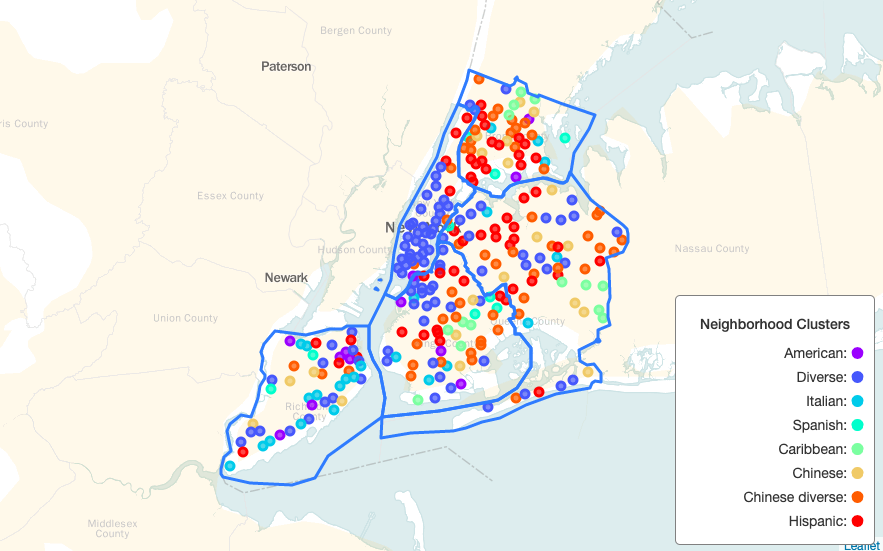
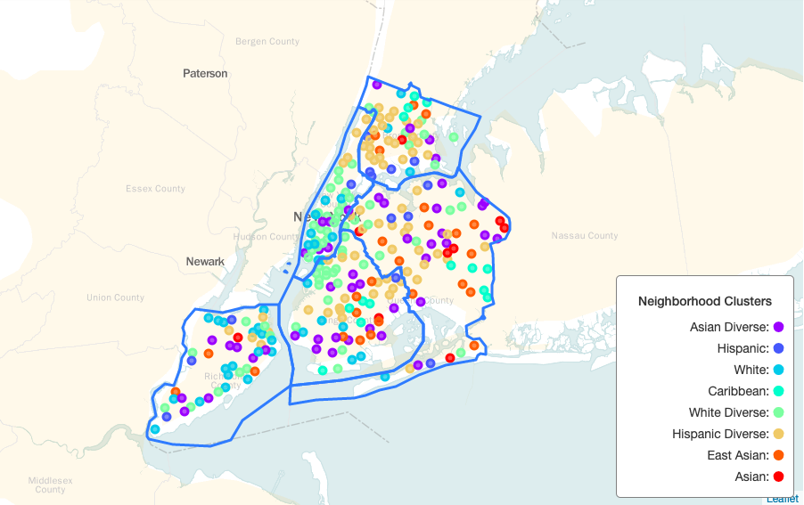
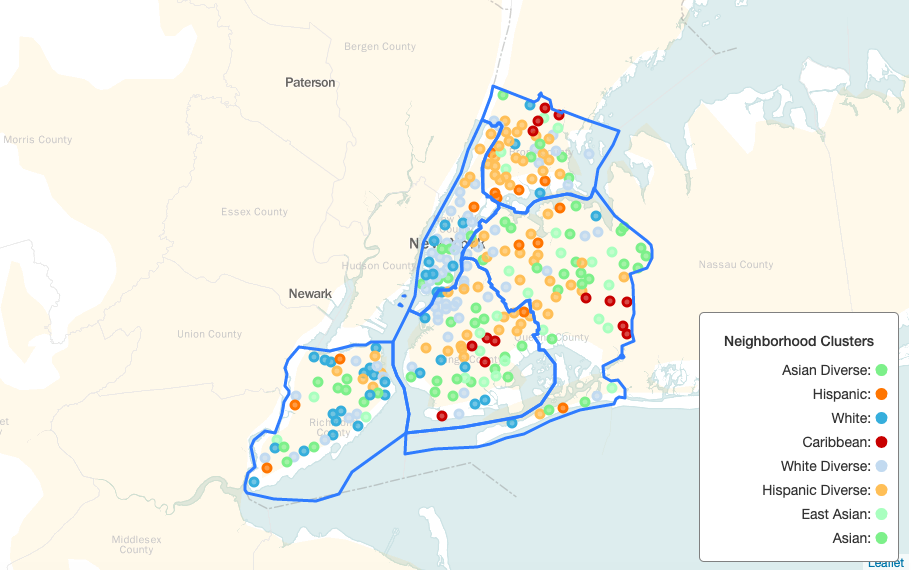

---
presentation:
  width: 1280
  height: 800
  theme: white.css
---

<!-- slide -->
# Identifying Ethnic Neighborhoods of New York City by Food Culture
### Capstone Project: The Battle of Neighborhoods
### Yanbo Ye
### 2019-05-20

<!-- slide -->
## Identifying neighborhood ethnicity of New York City is useful

- New York City is a multicultural city most popular in the United State. The population of New York City is very diverse in ethnicity.
- Most people like to live in a neighborhood with those of their own ethnic group.
- The ethnicity of food venues nearby could be used to cluster neighborhoods using k-means.
- Identifying the dominant race of a neighborhood would be helpful to those who want to live or do bushiness there.

<!-- slide -->
## Data acquisition and cleaning

- The neighborhood name and location data of New York City was downloaded from [New York University](https://geo.nyu.edu/catalog/nyu_2451_34572).
- The food venue data with name, category and location of each neighborhood was downloaded from Foursquare's [explore api](https://developer.foursquare.com/docs/api/venues/explore).
- The relation of food venue categories was downloaded from Foursquare's [categories api](https://developer.foursquare.com/docs/api/venues/categories).
- 3805 food venues of 40 categories, which are literally ethnical, were included as feature data for 271 neighborhoods.

<!-- slide -->
## Neighborhood ethnicity weight measurement

- For one neighborhood, the vector of venue count of each categories denote as: $$\vec C = (c_1, c_2, \cdots, c_n)$$

- Weight contribution of categories, we'll define neighborhood feature vector as: $$\vec F = \frac{\vec C}{\sum_{i=1}^n{c_i}}$$

- For all $m$ neighborhood, we got our feature matrix as:

$$F =
\begin{pmatrix}
\vec F_1\\
\vec F_2\\
\vdots\\
\vec F_m\\
\end{pmatrix}$$

<!-- slide -->
## Cluster ethnicity weight measurement

- After clustering, we need to examine the cluster and assign each cluster an label. Suppose we got $k$ clusters. For each cluster with $N$ neighborhoods, we use the mean to measure each category weight. We got our category weight matrix of clusters as:

$$E =
\begin{pmatrix}
\frac{\sum_{i=1}^{N_1} \vec F_i}{N_1} \\
\frac{\sum_{i=1}^{N_2} \vec F_i}{N_2} \\
\vdots\\
\frac{\sum_{i=1}^{N_k} \vec F_i}{N_k} \\
\end{pmatrix}$$

<!-- slide -->
## Top 10 category weights of clusters with raw categories

Clusters were labeled as: **American**, **Diverse**, **Italian**, **Spanish**, **Caribbean**, **Chinese**, **Chinese diverse**, **Hispanic**.

<!-- slide -->
## Neighborhoods distribution of different clusters with raw categories

<!-- slide -->
## Category weights of clusters with generalized categories

Clusters were labeled as: **Asian Diverse**, **Hispanic**, **White**, **Caribbean**, **White Diverse**, **Hispanic Diverse**, **East Asian**, **Asian**.

<!-- slide -->
## Neighborhoods distribution of different clusters with generalized categories

<!-- slide -->
## Comparison with real ethnicity distribution data of New York City

  
  

Left figure showing the **Predominant race/ethnicity by tract** from a research called ["COMMUNITIES OF INTEREST" IN NEW YORK CITY](https://www.gc.cuny.edu/Page-Elements/Academics-Research-Centers-Initiatives/Centers-and-Institutes/Center-for-Urban-Research/CUR-research-initiatives/Communities-of-Interest-in-New-York-City).

Right one was redrawn of the second result by taking the same colors of respective ethnic groups.

<!-- slide -->
## Comparison similarity and diversity

- Similarity:
  1. Neighborhoods in *Staten Island* and *Manhattan* are mostly **White** dominant.
  2. The **Hispanic** neighborhoods are mainly distributed in *The Bronx* and area between *Brooklyn* and *Queens*.
  3. The **Caribbean** neighborhoods can be divided into three geographical clusters in *The Bronx*, *Queens* and *Brooklyn*.
- Diversity:
  1. The **Asian** neighborhoods distribution pattern, which scatter everywhere, is not like the previous one that most **Asian** neighborhoods are in *Queens*.
  2. The **African** neighborhoods are not shown on our map.

<!-- slide -->
## Conclusion

- We clustered neighborhoods in New York City into different ethnic groups based on the food venue data.
- The result is comparable to the real race distribution of New York City.
- Thus we provide a good way to cluster and identify the dominant ethnicity of neighborhoods.
- Include more categories by study the culture background of all food categories might improve our result.

